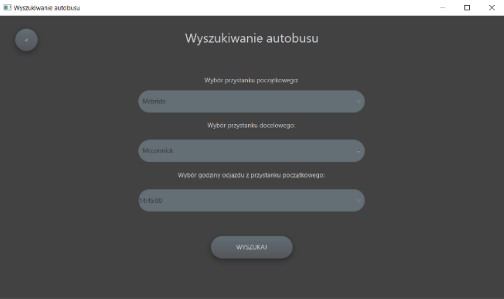
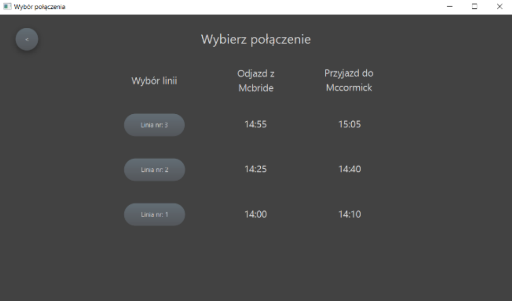
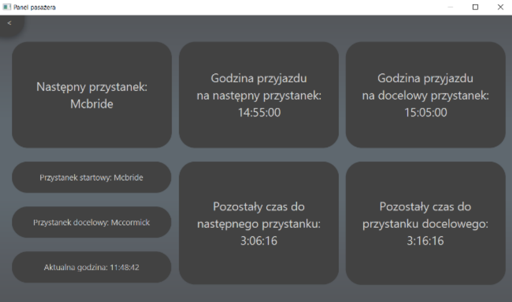
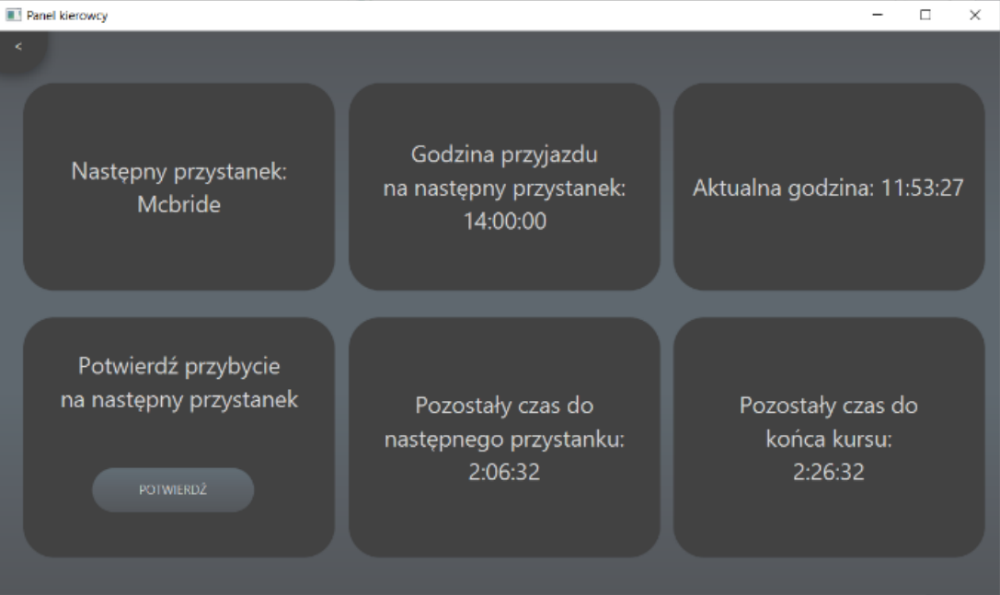
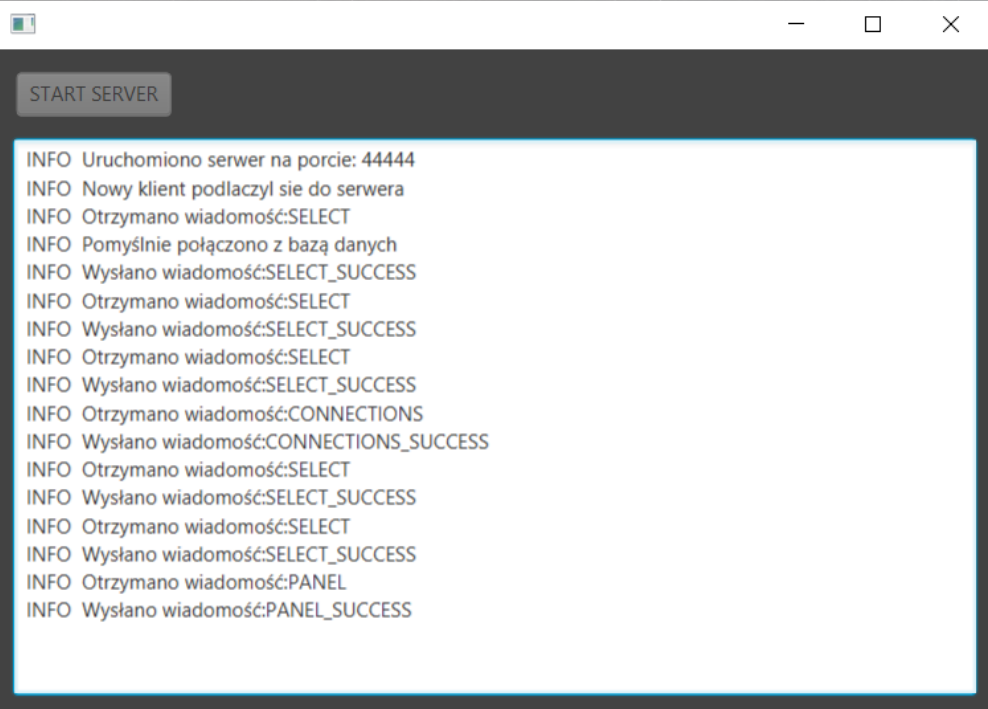

# Public Transport Service System
Public transport service system. App developed in 2021.

## Description

Application designed in client-server model designed for drivers and passengers of public transport. Passenger mode allows you to search for a bus connection based on starting stop, destination stop and arrival time. Driver mode provides access to statistics such as time of arrival at the next scheduled stop, countdown to arrival time, the name of the next stop, the countdown to the end of the course, the time of the end of the course.

## Technologies Used
### Languages
- Java
- SQL
### Libraries
- javaFx 16 – GUI
- jfoenix 9.0.10 – GUI addons
- jUnit 4.13.2 – testing
- log4j 1.2.17 – logs
- mariadb 2.6.0 - database

## Example Screenshots
### Searching bus

### Choosing bus

### Passenger panel

### Driver panel

### Server panel

